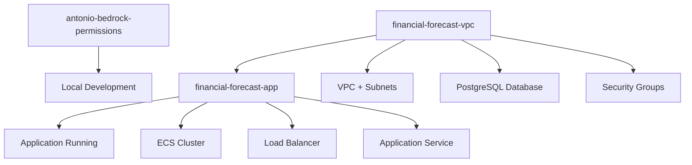

# Financial Forecast AI - Deployment Guide

This guide provides step-by-step instructions for deploying the Financial Forecast AI application to AWS using CloudFormation.

## 📋 Prerequisites

### AWS Account Setup
- ✅ AWS Account with appropriate permissions
- ✅ AWS CLI installed and configured
- ✅ Docker installed (for containerization)
- ✅ Python 3.11+ installed locally

### Required AWS Services Access
- ✅ AWS Bedrock (with Amazon Titan Text model access)
- ✅ Amazon ECS (Fargate)
- ✅ Amazon RDS (PostgreSQL)
- ✅ Amazon VPC
- ✅ AWS Secrets Manager
- ✅ Elastic Load Balancing
- ✅ Amazon ECR (Elastic Container Registry)

## 🚀 Deployment Steps

### Step 1: Configure AWS CLI

```bash
# Configure AWS CLI with your credentials
aws configure

# Verify configuration
aws sts get-caller-identity
```

### Step 2: Request Bedrock Model Access

1. **Navigate to AWS Bedrock Console**
   ```
   https://console.aws.amazon.com/bedrock/
   ```

2. **Request Model Access**
   - Go to "Model access" in left sidebar
   - Click "Request model access"
   - Find "Amazon Titan Text Large" and request access
   - Fill out use case form:
     - **Use Case**: Financial analysis application for mortgage prepayment forecasting
     - **Industry**: Financial Services
     - **Application**: Commercial analytical platform

3. **Wait for Approval** (usually 15 minutes to 2 hours)

### Step 3: Deploy IAM Permissions (For Development)

Deploy Bedrock permissions for local development access:

```bash
# Navigate to project directory
cd c:\Users\anton\OneDrive\Desktop\AI\finalcial_forecast_ia_app

# Deploy complete infrastructure (VPC + Database + IAM)
aws cloudformation create-stack \
  --stack-name financial-forecast-complete \
  --template-body file://infra/cloudformation.yaml \
  --capabilities CAPABILITY_IAM \
  --parameters ParameterKey=Environment,ParameterValue=dev \
               ParameterKey=UserName,ParameterValue=Antonio

# Check deployment status
aws cloudformation describe-stacks \
  --stack-name financial-forecast-complete \
  --query "Stacks[0].StackStatus"
```

### Step 4: Monitor Infrastructure Deployment

Wait for the complete infrastructure to deploy:

```bash
# Monitor deployment progress (takes 10-15 minutes)
aws cloudformation wait stack-create-complete \
  --stack-name financial-forecast-complete

# Verify stack creation and get outputs
aws cloudformation describe-stacks \
  --stack-name financial-forecast-complete \
  --query "Stacks[0].Outputs"
```

### Step 5: Create ECR Repository and Build Container

Create container repository and build the application image:

```bash
# Create ECR repository
aws ecr create-repository \
  --repository-name financial-forecast-ai \
  --region us-east-1

# Get ECR login token
aws ecr get-login-password --region us-east-1 | docker login --username AWS --password-stdin <AWS_ACCOUNT_ID>.dkr.ecr.us-east-1.amazonaws.com

# Build Docker image
docker build -t financial-forecast-ai .

# Tag image for ECR
docker tag financial-forecast-ai:latest <AWS_ACCOUNT_ID>.dkr.ecr.us-east-1.amazonaws.com/financial-forecast-ai:latest

# Push image to ECR
docker push <AWS_ACCOUNT_ID>.dkr.ecr.us-east-1.amazonaws.com/financial-forecast-ai:latest
```

> **Note**: Replace `<AWS_ACCOUNT_ID>` with your actual AWS Account ID

### Step 6: Deploy Application Infrastructure

Deploy the ECS application after VPC stack completes:

```bash
# Deploy Application stack
aws cloudformation create-stack \
  --stack-name financial-forecast-app \
  --template-body file://infra/app.yaml \
  --capabilities CAPABILITY_IAM \
  --parameters ParameterKey=Environment,ParameterValue=dev \
              ParameterKey=VPCStackName,ParameterValue=financial-forecast-vpc

# Monitor deployment progress (takes 5-10 minutes)
aws cloudformation wait stack-create-complete \
  --stack-name financial-forecast-app

# Get application URL
aws cloudformation describe-stacks \
  --stack-name financial-forecast-app \
  --query "Stacks[0].Outputs[?OutputKey=='ApplicationURL'].OutputValue" \
  --output text
```

## 🔍 Verification Steps

### Check Stack Status

```bash
# List all deployed stacks
aws cloudformation list-stacks \
  --stack-status-filter CREATE_COMPLETE UPDATE_COMPLETE \
  --query "StackSummaries[?contains(StackName, 'financial')].{Name:StackName,Status:StackStatus,CreationTime:CreationTime}" \
  --output table
```

### Verify ECS Service

```bash
# Check ECS cluster status
aws ecs describe-clusters \
  --clusters dev-FinancialForecastCluster

# Check service status
aws ecs describe-services \
  --cluster dev-FinancialForecastCluster \
  --services arn:aws:ecs:us-east-1:<ACCOUNT_ID>:service/dev-FinancialForecastCluster/<SERVICE_NAME>
```

### Test Application

```bash
# Get application URL
APPLICATION_URL=$(aws cloudformation describe-stacks \
  --stack-name financial-forecast-app \
  --query "Stacks[0].Outputs[?OutputKey=='ApplicationURL'].OutputValue" \
  --output text)

echo "Application URL: $APPLICATION_URL"

# Test application health
curl -I $APPLICATION_URL
```

## 🗂️ Stack Dependencies



## 🏗️ Infrastructure Components

### VPC Stack (`financial-forecast-vpc`)
- **VPC**: 10.0.0.0/16 CIDR
- **Public Subnets**: 2 subnets for Load Balancer
- **Private Subnets**: 2 subnets for ECS tasks
- **RDS PostgreSQL**: Database with pgvector extension
- **Security Groups**: Database and Load Balancer security
- **Secrets Manager**: Database credentials

### Application Stack (`financial-forecast-app`)
- **ECS Cluster**: Fargate cluster for containerized app
- **Application Load Balancer**: Internet-facing load balancer
- **ECS Service**: Auto-scaling Streamlit application
- **Task Definition**: Container configuration with IAM roles
- **Target Group**: Health checking and routing

### IAM Stack (`antonio-bedrock-permissions`)
- **Bedrock Policy**: Full access to AWS Bedrock services
- **User Attachment**: Attached to specified IAM user

## 🔧 Environment Variables

The application uses these environment variables:

```bash
# Automatically set by CloudFormation
AWS_DEFAULT_REGION=us-east-1
POSTGRES_CONNECTION=<Retrieved from Secrets Manager>

# Required for local development
AWS_PROFILE=default
AWS_REGION=us-east-1
```

## 🚨 Troubleshooting

### Common Issues

1. **Bedrock Access Denied**
   ```bash
   # Check model access status
   aws bedrock list-foundation-models --query "modelSummaries[?contains(modelId, 'titan')]"
   ```

2. **ECS Task Failing**
   ```bash
   # Check ECS task logs
   aws logs describe-log-groups --log-group-name-prefix "/ecs/dev-FinancialForecast"
   ```

3. **Database Connection Issues**
   ```bash
   # Verify database status
   aws rds describe-db-instances --db-instance-identifier <DB_IDENTIFIER>
   ```

### Cleanup Commands

To remove all deployed resources:

```bash
# Delete application stack
aws cloudformation delete-stack --stack-name financial-forecast-app

# Wait for application stack deletion
aws cloudformation wait stack-delete-complete --stack-name financial-forecast-app

# Delete VPC stack
aws cloudformation delete-stack --stack-name financial-forecast-vpc

# Wait for VPC stack deletion
aws cloudformation wait stack-delete-complete --stack-name financial-forecast-vpc

# Delete IAM permissions (optional)
aws cloudformation delete-stack --stack-name antonio-bedrock-permissions

# Delete ECR repository
aws ecr delete-repository --repository-name financial-forecast-ai --force
```

## 📊 Monitoring and Logs

### Application Logs
```bash
# View ECS task logs
aws logs tail /ecs/dev-FinancialForecast --follow
```

### CloudFormation Events
```bash
# Monitor stack events
aws cloudformation describe-stack-events --stack-name financial-forecast-app
```

### Application Metrics
- **ECS Service Metrics**: CPU, Memory, Task count
- **Load Balancer Metrics**: Request count, Response time
- **Database Metrics**: Connections, Query performance

## 🎯 Production Considerations

### Security Enhancements
- [ ] Enable HTTPS with SSL certificate
- [ ] Implement WAF rules
- [ ] Enable VPC Flow Logs
- [ ] Set up AWS Config for compliance

### Scalability
- [ ] Configure Auto Scaling for ECS service
- [ ] Implement database read replicas
- [ ] Add CloudFront distribution
- [ ] Set up multi-region deployment

### Monitoring
- [ ] Set up CloudWatch dashboards
- [ ] Configure alerting for failures
- [ ] Implement distributed tracing
- [ ] Set up log aggregation

---

## 📞 Support

For deployment issues or questions:
- Check AWS CloudFormation console for stack events
- Review ECS service logs in CloudWatch
- Verify Bedrock model access in AWS Console
- Ensure all prerequisites are met

**Deployment Complete!** 🎉

Your Financial Forecast AI application should now be accessible via the Application Load Balancer URL.