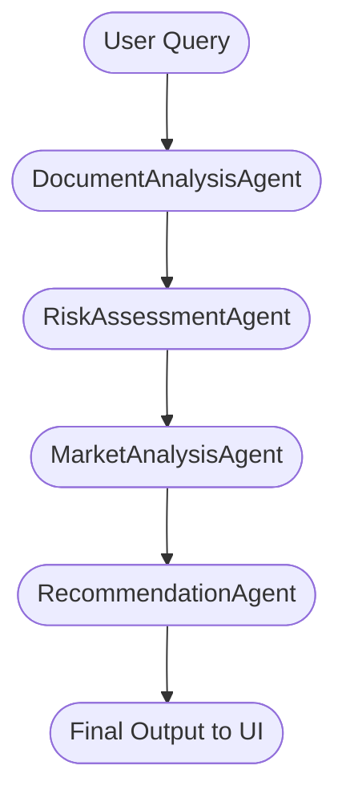

# 🧠 Multi-Agent Workflow Architecture for Financial Forecast AI

   

---

## 🚀 Overview
This document visually explains the multi-agent workflow architecture in the Financial Forecast AI app using LangGraph. Specialized agents collaborate to deliver expert financial analysis, risk assessment, and recommendations.

---

## 1. Motivation for Multi-Agent Architecture

|  |  |
|--|--|
| 🧩 **Complexity** | Multiple expert perspectives (document, risk, market, strategy) |
| 🏗️ **Modularity** | Each agent specializes in a domain |
| 📈 **Scalability** | Add new agents for more analysis types |
| 🔍 **Transparency** | Track agent reasoning and confidence |

---

## 2. Key Components

### 🕵️‍♂️ Agents

| Agent | Role |
|-------|------|
| 📄 **DocumentAnalysisAgent** | Extracts and summarizes key financial data |
| ⚠️ **RiskAssessmentAgent** | Assesses credit, market, and operational risks |
| 📊 **MarketAnalysisAgent** | Analyzes market conditions and trends |
| 💡 **RecommendationAgent** | Synthesizes outputs into recommendations |

### 🧩 Workflow Orchestrator
- **FinancialWorkflow**: LangGraph-based orchestrator managing agent order, state, and errors.

### 🗂️ State Management
- **WorkflowState**: Shared state with query, agent outputs, confidence, reasoning, and errors.

---

## 3. Visual Workflow Steps

---

## 4. Step-by-Step Table

| Step | Agent | Input | Output |
|------|-------|-------|--------|
| 1 | 📄 DocumentAnalysisAgent | User query | Document summary, context, confidence |
| 2 | ⚠️ RiskAssessmentAgent | Query, doc analysis | Risk summary, confidence |
| 3 | 📊 MarketAnalysisAgent | Query, doc & risk | Market summary, confidence |
| 4 | 💡 RecommendationAgent | All previous outputs | Recommendations, overall confidence |

---

## 5. State & Error Handling

- 🗂️ **State**: Each agent updates the shared state with results, confidence, and reasoning.
- 🛡️ **Error Handling**: If an agent fails, the workflow logs the error and continues with fallbacks.
- 📊 **Confidence Scores**: Each agent provides a confidence score; the final score is aggregated.

---

## 6. Integration with FinancialAgent

     
   <b>FinancialAgent</b> initializes the LangGraph workflow and routes queries. 
   Simple queries use a single-agent fallback. 
   The UI displays all agent contributions and document sources.

---

## 7. Extending the Workflow

| Action | How |
|--------|-----|
| ➕ Add new agent | Implement new agent class, add to workflow |
| 🔄 Change order | Modify LangGraph state graph |
| 🌿 Custom branching | Use LangGraph conditional edges |

---

## 8. Benefits

|  |  |
|--|--|
| 🧠 **Expertise** | Each agent brings domain knowledge |
| 🔎 **Transparency** | Reasoning and confidence are visible |
| 🛡️ **Resilience** | Errors in one agent don't halt workflow |
| 📈 **Scalability** | Add new modules as needed |

---

## 9. Example Output Structure

| Section | Content |
|---------|---------|
| 📄 Document Analysis | Key findings, data quality, document list |
| ⚠️ Risk Assessment | Credit, market, operational risk summary |
| 📊 Market Analysis | Current conditions, projections, macro factors |
| 💡 Recommendations | Executive summary, action items, projections |
| 🧩 Agent Reasoning | Explanation of each agent's contribution |
| 📁 Source Documents | List of analyzed documents with relevance |

---

## 10. References

- [LangGraph Documentation](https://github.com/langchain-ai/langgraph)
- [Financial Forecast AI Architecture](ARCHITECTURE.md)
- [FinancialAgent Implementation](src/agents/financial_agent.py)
- [Workflow Implementation](src/agents/workflow.py)

---

*This document should be updated as new agents or workflow steps are added to the system.*
