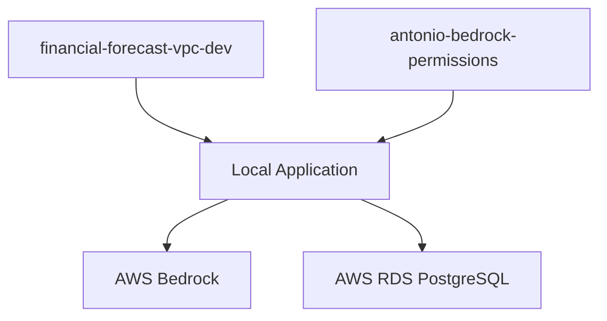

# Financial Forecast AI - Infrastructure Deployment Guide

This directory contains the complete CloudFormation infrastructure for the Financial Forecast AI application.

## 📁 Infrastructure Files

### �️ **Individual Templates** (Extracted from Deployed Stacks)

#### 1. **`vpc-database.yaml`** - VPC and Database Infrastructure
- **Source**: Extracted from `financial-forecast-vpc-dev` stack
- **Resources**: 
  - ✅ VPC with public/private subnets across 2 AZs
  - ✅ PostgreSQL RDS database (db.t3.medium)  
  - ✅ Security groups for ALB and database
  - ✅ Secrets Manager for database credentials
  - ✅ Internet Gateway and Route Tables
- **Parameters**: Environment (dev/prod)

#### 2. **`iam-permissions.yaml`** - Bedrock IAM Permissions
- **Source**: Extracted from `antonio-bedrock-permissions` stack
- **Resources**:
  - ✅ IAM policy for full Bedrock access
  - ✅ CloudWatch Logs permissions
  - ✅ Policy attached to specified user
- **Parameters**: UserName (default: Antonio)
- **Requires**: CAPABILITY_IAM capability

## 📊 **Current Deployment Status**

### Legacy Separate Stacks (Currently Deployed)
- ✅ **`financial-forecast-vpc-dev`** (CREATE_COMPLETE - 2025-10-17)
  - VPC, PostgreSQL database, security groups  
- ✅ **`antonio-bedrock-permissions`** (CREATE_COMPLETE - 2025-10-18)
  - IAM Bedrock policy for Antonio user

### 🎯 **Recommended Migration** 
Use the combined `cloudformation.yaml` template for future deployments to simplify management.

## 🚀 **Deploy Infrastructure**

### 🎯 **Recommended: Consolidated Template**

Deploy everything in a single stack using the consolidated template:

```powershell
# Create new consolidated stack
aws cloudformation create-stack `
  --stack-name financial-forecast-complete `
  --template-body file://infra/cloudformation.yaml `
  --capabilities CAPABILITY_IAM `
  --parameters ParameterKey=Environment,ParameterValue=dev ParameterKey=UserName,ParameterValue=Antonio

# Update existing consolidated stack
aws cloudformation update-stack `
  --stack-name financial-forecast-complete `
  --template-body file://infra/cloudformation.yaml `
  --capabilities CAPABILITY_IAM `
  --parameters ParameterKey=Environment,ParameterValue=dev ParameterKey=UserName,ParameterValue=Antonio
```

### 🏗️ **Individual Templates** (Legacy)

### Deploy VPC and Database Stack
```powershell
aws cloudformation create-stack `
  --stack-name financial-forecast-vpc-dev `
  --template-body file://infra/vpc-database.yaml `
  --parameters ParameterKey=Environment,ParameterValue=dev
```

### Deploy IAM Permissions Stack
```powershell
aws cloudformation create-stack `
  --stack-name antonio-bedrock-permissions `
  --template-body file://infra/iam-permissions.yaml `
  --capabilities CAPABILITY_IAM `
  --parameters ParameterKey=UserName,ParameterValue=Antonio
```

### Update Existing Stacks
```powershell
# Update VPC stack
aws cloudformation update-stack `
  --stack-name financial-forecast-vpc-dev `
  --template-body file://infra/vpc-database.yaml `
  --parameters ParameterKey=Environment,ParameterValue=dev

# Update IAM stack
aws cloudformation update-stack `
  --stack-name antonio-bedrock-permissions `
  --template-body file://infra/iam-permissions.yaml `
  --capabilities CAPABILITY_IAM `
  --parameters ParameterKey=UserName,ParameterValue=Antonio
```

## Current Architecture

```
🖥️ Local Machine (Windows)
├── PowerShell Terminal
├── Python Virtual Environment (.venv)
├── Streamlit Server (localhost:8516)
└── Financial Forecast AI App
    ├── 🧠 Amazon Titan Text (AWS Bedrock)
    │   └── 🔐 IAM Policy: antonio-bedrock-permissions
    └── 🗄️ PostgreSQL Database
        └── 📍 RDS: financial-forecast-vpc-dev
```

## Stack Dependencies



### 🔍 **Validation Commands**

```powershell
# Validate consolidated template
aws cloudformation validate-template --template-body file://infra/cloudformation.yaml

# Validate individual templates
aws cloudformation validate-template --template-body file://infra/vpc-database.yaml
aws cloudformation validate-template --template-body file://infra/iam-permissions.yaml
```

# Check current stack status
aws cloudformation list-stacks --stack-status-filter CREATE_COMPLETE UPDATE_COMPLETE

# Monitor deployment progress
aws cloudformation describe-stack-events --stack-name financial-forecast-vpc-dev
aws cloudformation describe-stack-events --stack-name antonio-bedrock-permissions

# Get stack outputs
aws cloudformation describe-stacks --stack-name financial-forecast-vpc-dev --query "Stacks[0].Outputs"
aws cloudformation describe-stacks --stack-name antonio-bedrock-permissions --query "Stacks[0].Outputs"
```

## 🏗️ **What Gets Deployed**

- **VPC**: Complete network with public/private subnets across 2 AZs
- **RDS**: PostgreSQL 13.15 database (db.t3.medium) with automated backups
- **Security**: Proper security groups for database and ALB access
- **Secrets**: Managed database credentials via AWS Secrets Manager  
- **IAM**: Bedrock permissions for specified user (Antonio)
- **Networking**: Internet Gateway, Route Tables, and proper associations