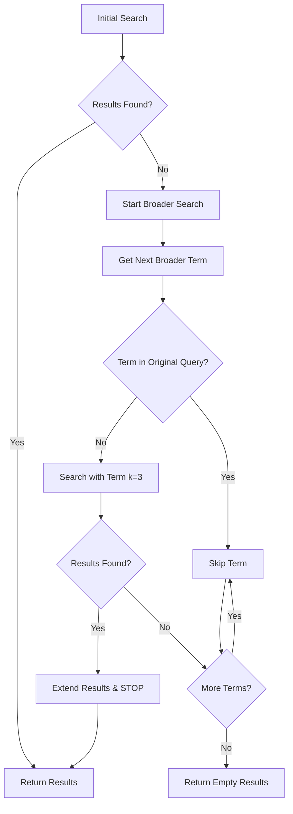

# Broader Search Mechanism

## Overview

The **Broader Search** is a fallback strategy implemented in the Financial Forecast AI system that activates when the initial document search returns no results. It serves as a safety net to ensure users always receive relevant financial content from their uploaded documents, even when their specific query doesn't match well with the document embeddings.

## Implementation Location

- **File**: `src/agents/financial_agent.py`
- **Function**: `_single_agent_analysis()`
- **Lines**: 327-339

## How It Works

### 1. Trigger Condition

```python
# If no results found, try alternative search approaches
if not search_results:
    print("🔄 No initial results, trying broader search...")
```

The broader search activates when:
- Initial vector similarity search returns 0 results
- Deal-specific searches find no matching documents
- Regular document searches fail to find relevant content

### 2. Broader Terms Strategy

```python
broader_terms = ["financial", "revenue", "profit", "analysis", "data", "report", "summary", "total", "amount", "year", "quarter", "percent", "%"]
```

The system uses a **predefined list of general financial keywords** that are commonly found in financial documents:

| Category | Terms |
|----------|-------|
| **General Financial** | financial, revenue, profit, analysis |
| **Document Types** | data, report, summary |
| **Quantitative** | total, amount, percent, % |
| **Time Periods** | year, quarter |

### 3. Sequential Search Logic

```python
for term in broader_terms:
    if term.lower() in query.lower():
        continue  # Skip if already searched
    broader_results = self.vector_store.search_documents(term, k=3)
    if broader_results:
        search_results.extend(broader_results)
        print(f"🔍 Found {len(broader_results)} results with broader term '{term}'")
        break
```

**Key Behaviors:**

#### ✅ Smart Redundancy Prevention
- **Skips terms already in query**: If the broader term is already present in the user's query, it skips to the next term
- **Example**: User asks "financial analysis" → skips "financial" → tries "revenue"

#### ✅ Performance Optimization
- **Limited results per term**: Only searches for `k=3` documents per broader term (vs normal `k=5-7`)
- **First match wins**: Stops at the first broader term that returns results (`break` statement)
- **No exhaustive search**: Doesn't try all terms if one succeeds

#### ✅ Result Aggregation
- **Extends existing results**: Adds broader results to the (empty) search_results list
- **Preserves search metadata**: Maintains similarity scores and document metadata

## Example Scenarios

### Scenario 1: Technical Query
```
User Query: "What is the yield curve analysis?"
Initial Search: "yield curve analysis" → 0 results
Broader Search: "financial" → 3 documents found → STOP
Result: Returns 3 financial documents for general context
```

### Scenario 2: Query with Existing Term
```
User Query: "Show me financial data trends"
Initial Search: "financial data trends" → 0 results
Broader Search: Skip "financial" (already in query) → "revenue" → 3 documents → STOP
Result: Returns 3 revenue-related documents
```

### Scenario 3: Deal-Specific Fallback
```
User Query: "What about XYZ-123 deal structure?"
Initial Search: Deal-specific search → 0 results
Broader Search: "financial" → 3 documents → STOP
Result: Returns general financial documents for context
```

### Scenario 4: Multiple Attempts
```
User Query: "Show me portfolio metrics"
Initial Search: "portfolio metrics" → 0 results
Broader Search: 
  - "financial" → 0 results → continue
  - "revenue" → 0 results → continue  
  - "profit" → 3 documents → STOP
Result: Returns 3 profit-related documents
```

## Search Flow Diagram



## Code Implementation

```python
# If no results found, try alternative search approaches
if not search_results:
    print("🔄 No initial results, trying broader search...")
    broader_terms = ["financial", "revenue", "profit", "analysis", "data", "report", "summary", "total", "amount", "year", "quarter", "percent", "%"]
    for term in broader_terms:
        if term.lower() in query.lower():
            continue  # Skip if already searched
        broader_results = self.vector_store.search_documents(term, k=3)
        if broader_results:
            search_results.extend(broader_results)
            print(f"🔍 Found {len(broader_results)} results with broader term '{term}'")
            break
```

## Purpose & Benefits

### ✅ User Experience
- **Prevents empty responses**: Ensures users get *some* relevant content even when specific queries fail
- **Maintains engagement**: Provides context that might lead to better follow-up questions
- **Educational value**: Exposes users to available document content

### ✅ System Reliability
- **Graceful degradation**: System doesn't fail completely when embeddings don't match
- **Fallback mechanism**: Provides backup when primary search strategies fail
- **Error recovery**: Handles edge cases in document matching

### ✅ Performance Optimization
- **Limited scope**: Only searches 3 documents per term to maintain speed
- **Early termination**: Stops at first successful match to avoid unnecessary processing
- **Smart filtering**: Skips redundant terms already in the query

## Limitations & Considerations

### ⚠️ Potential Issues

#### **Relevance Degradation**
- May return less relevant results compared to specific queries
- General financial terms might not match user's specific intent
- Could provide context that's too broad for specialized questions

#### **Fixed Term List**
- Doesn't adapt to document content or domain-specific terminology
- Limited to predefined financial terms
- May miss domain-specific keywords in specialized documents

#### **Sequential Processing**
- Only tries one broader term at a time
- Doesn't combine multiple broader terms for better coverage
- Order of terms in the list affects search priority

### ⚠️ Edge Cases

#### **All Broader Terms Fail**
```python
# If all broader terms fail, returns empty results
search_results = []  # Empty list leads to "No relevant content found" message
```

#### **Term Already in Query**
```python
# User query: "financial analysis report data"
# Skips: "financial", "analysis", "report", "data"
# Only tries: "revenue", "profit", "summary", etc.
```

## Monitoring & Debugging

### Log Messages
```
🔄 No initial results, trying broader search...
🔍 Found 3 results with broader term 'revenue'
```

### Debug Information
- Track which broader terms are being tried
- Monitor success rates of different broader terms
- Identify queries that trigger broader search frequently

## Future Enhancements

### 🔮 Potential Improvements

1. **Dynamic Term Generation**
   - Extract important terms from uploaded documents
   - Use TF-IDF to identify document-specific keywords
   - Adapt broader terms based on document corpus

2. **Multi-Term Combination**
   - Try combinations of broader terms
   - Use OR logic to search multiple terms simultaneously
   - Weighted scoring based on term relevance

3. **Learning Mechanism**
   - Track which broader terms work best for different query types
   - Reorder broader terms based on success rates
   - Personalize broader terms based on user's document collection

4. **Contextual Adaptation**
   - Use conversation context to guide broader term selection
   - Apply topic modeling to choose relevant broader terms
   - Consider user's recent queries to refine broader search

## Configuration

### Current Settings
- **Results per term**: `k=3`
- **Term list**: Fixed 13 financial terms
- **Search strategy**: Sequential, first-match-wins
- **Scope**: Document content and metadata

### Customization Options
```python
# In _single_agent_analysis() function
broader_terms = [
    "financial", "revenue", "profit", "analysis",
    "data", "report", "summary", "total", 
    "amount", "year", "quarter", "percent", "%"
]
```

To customize, modify the `broader_terms` list in the `_single_agent_analysis()` method.