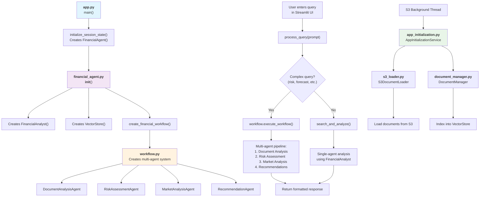

# Financial Forecast AI - Call Flow Documentation

## Overview
This document provides a comprehensive view of the call flow and execution paths through the Financial Forecast AI application's Python modules.

## 🔄 Application Architecture Flow



## 📋 Detailed Call Flow Analysis

### 1. Application Startup (`src/ui/app.py`)

**Entry Point:** `main()`

```python
main()
├── load_custom_css()                    # Load CSS animations and styling
├── initialize_session_state()           # Initialize core components
│   ├── st.session_state.messages = []
│   ├── st.session_state.agent = FinancialAgent()  # 🔄 CALLS financial_agent.py
│   └── st.session_state.processed_docs = []
├── create_header()                      # Render app header with animations
├── create_metrics_dashboard()           # Display system metrics
├── create_chat_interface()              # Main user interaction area
├── create_sidebar()                     # Document upload & management
└── Footer rendering
```

**Key Function Calls:**
- `FinancialAgent()` → Initializes the main AI agent
- `process_query(prompt)` → Handles user queries
- `AppInitializationService()` → S3 document loading (background)

### 2. Financial Agent Initialization (`src/agents/financial_agent.py`)

**Entry Point:** `FinancialAgent.__init__()`

```python
FinancialAgent.__init__()
├── self.analyst = FinancialAnalyst()               # 🔄 CALLS analyst.py
├── self.vector_store = VectorStore()               # 🔄 CALLS vector_store.py
├── self.workflow = create_financial_workflow()     # 🔄 CALLS workflow.py
│   ├── Success: self.use_multi_agent = True
│   └── Failure: self.use_multi_agent = False (fallback mode)
└── Print initialization status
```

**Key Responsibilities:**
- Creates and orchestrates all AI components
- Initializes multi-agent workflow system
- Provides fallback to single-agent mode if needed

### 3. Query Processing Flow

**Entry Point:** `process_query(query: str)`

```python
process_query(query)
├── Complex query detection
│   └── Keywords: ['risk', 'market', 'forecast', 'analysis', 'assessment', 'recommendation', 'strategy', 'prepayment', 'portfolio']
│
├── IF complex_query AND multi_agent_available:
│   ├── workflow.execute_workflow(query)     # 🔄 CALLS workflow.py
│   ├── Multi-agent pipeline execution
│   └── Return formatted multi-agent response
│
├── ELSE (simple query OR fallback):
│   ├── search_and_analyze(query)           # 🔄 CALLS vector search + analyst
│   ├── Single-agent analysis
│   └── Return single-agent response
│
└── Exception handling and error responses
```

### 4. Multi-Agent Workflow Execution (`src/agents/workflow.py`)

**Entry Point:** `create_financial_workflow(vector_store)`

```python
create_financial_workflow()
├── Initialize 4 specialized agents:
│   ├── DocumentAnalysisAgent              # Extract info from documents
│   ├── RiskAssessmentAgent               # Evaluate financial risks
│   ├── MarketAnalysisAgent               # Analyze market conditions
│   └── RecommendationAgent               # Generate recommendations
│
├── Create LangGraph StateGraph:
│   ├── router_node()                     # Route queries to appropriate agents
│   ├── document_analysis_node()          # Document processing
│   ├── risk_assessment_node()            # Risk evaluation
│   ├── market_analysis_node()            # Market analysis
│   ├── recommendation_node()             # Final recommendations
│   └── Define conditional edges and flow
│
└── Return FinancialWorkflow instance
```

**Workflow Execution:** `execute_workflow(query)`

```python
execute_workflow(query)
├── Initialize WorkflowState:
│   ├── query = user_query
│   ├── context_documents = []
│   ├── document_analysis = ""
│   ├── risk_assessment = ""
│   ├── market_analysis = ""
│   ├── final_recommendation = ""
│   ├── confidence_scores = {}
│   ├── agent_reasoning = {}
│   └── current_step = "starting"
│
├── Execute workflow.invoke(initial_state):
│   ├── router_node()                     # Determine processing path
│   ├── document_analysis_node()          # 🔄 CALLS DocumentAnalysisAgent
│   ├── risk_assessment_node()            # 🔄 CALLS RiskAssessmentAgent
│   ├── market_analysis_node()            # 🔄 CALLS MarketAnalysisAgent
│   └── recommendation_node()             # 🔄 CALLS RecommendationAgent
│
├── Format comprehensive response
└── Return success/failure with confidence scores
```

### 5. Individual Agent Processing

#### DocumentAnalysisAgent
```python
analyze(state, query)
├── vector_store.search_documents(query)    # 🔄 CALLS vector_store.py
├── Extract relevant document chunks
├── Bedrock LLM analysis of documents
├── Update state.document_analysis
└── Return enriched state
```

#### RiskAssessmentAgent
```python
assess_risk(state, query)
├── Analyze document_analysis results
├── Bedrock LLM risk evaluation
├── Generate risk scores and factors
├── Update state.risk_assessment
└── Return enriched state
```

#### MarketAnalysisAgent
```python
analyze_market(state, query)
├── Consider market conditions
├── Bedrock LLM market analysis
├── Generate market insights
├── Update state.market_analysis
└── Return enriched state
```

#### RecommendationAgent
```python
generate_recommendations(state, query)
├── Synthesize all previous analyses
├── Bedrock LLM recommendation generation
├── Create final recommendations
├── Update state.final_recommendation
├── Calculate confidence_scores
└── Return complete state
```

### 6. Vector Store Operations (`src/agents/vector_store.py`)

**Initialization:** `VectorStore.__init__()`

```python
VectorStore.__init__()
├── Check USE_LOCAL_STORAGE environment variable
├── IF using PostgreSQL/pgvector:
│   ├── Initialize BedrockEmbeddings (Amazon Titan)
│   ├── Connect to PGVector database
│   └── Handle connection errors (fallback to local)
├── ELSE:
│   └── Use in-memory storage for development
└── Initialize RecursiveCharacterTextSplitter
```

**Key Operations:**
```python
index_document(document, metadata)
├── text_splitter.split_text(document)     # Chunk document
├── IF using PGVector:
│   └── vector_store.add_texts(chunks, metadata)
└── ELSE:
    └── Store in self.documents[] (local)

search_documents(query, k=5)
├── IF using PGVector:
│   └── vector_store.similarity_search_with_score(query)
└── ELSE:
    ├── Enhanced text matching (exact phrases, word matches)
    ├── Calculate relevance scores
    └── Return top k results sorted by relevance
```

### 7. Financial Analyst (`src/agents/analyst.py`)

**Initialization:** `FinancialAnalyst.__init__()`

```python
FinancialAnalyst.__init__()
├── Initialize Amazon Titan LLM:
│   ├── model_id: "amazon.titan-tg1-large"
│   ├── temperature: 0.8
│   ├── max_tokens_to_sample: 1000
│   └── top_p: 1
├── Set system context for financial analysis
└── Handle initialization errors with fallback
```

**Analysis Flow:** `analyze(query, context)`

```python
analyze(query, context)
├── Format prompt with financial context
├── Call Bedrock LLM with structured prompt
├── Process and format response
└── Return analysis results
```

### 8. S3 Document Loading (Background Process)

**Entry Point:** `s3_background_thread()` in `app.py`

```python
s3_background_thread(agent, callback)
├── AppInitializationService(agent.vector_store)    # 🔄 CALLS app_initialization.py
├── Check if S3 auto-loading is enabled
├── Initialize knowledge base
└── Update UI status via callback
```

**App Initialization Service:** `src/agents/app_initialization.py`

```python
AppInitializationService.__init__()
├── self.vector_store = vector_store
├── self.document_manager = DocumentManager()       # 🔄 CALLS document_manager.py
├── Load S3 configuration from environment
└── self.s3_loader = S3DocumentLoader()            # 🔄 CALLS s3_loader.py

initialize_knowledge_base()
├── Check S3 configuration
├── s3_loader.load_documents()                      # Load from S3
├── document_manager.process_documents_batch()      # Process and index
└── Return processing results
```

**S3 Document Loader:** `src/agents/s3_loader.py`

```python
S3DocumentLoader.load_documents()
├── Initialize boto3 S3 client
├── List objects in S3 bucket with prefix
├── Download and extract text from each document:
│   ├── PDF files: Use pypdf
│   ├── Word files: Use python-docx
│   ├── Excel files: Use pandas
│   ├── Text files: Direct reading
│   └── Other formats: Appropriate parsers
├── Create metadata for each document
└── Return list of processed documents
```

**Document Manager:** `src/agents/document_manager.py`

```python
DocumentManager.process_documents_batch(documents)
├── FOR each document:
│   ├── Create UI-style metadata
│   ├── vector_store.index_document()              # 🔄 CALLS vector_store.py
│   ├── Calculate chunks created
│   └── Track processing results
├── Generate processing summary
└── Return batch results
```

## 🎯 Key Integration Points

### User Query Processing
1. **UI Input** → `app.py:create_chat_interface()`
2. **Query Processing** → `financial_agent.py:process_query()`
3. **Multi-Agent Decision** → Complex query detection
4. **Workflow Execution** → `workflow.py:execute_workflow()`
5. **Response Formatting** → Back to UI with animations

### Document Management
1. **S3 Background Loading** → `app_initialization.py`
2. **Document Processing** → `s3_loader.py` + `document_manager.py`
3. **Vector Indexing** → `vector_store.py:index_document()`
4. **Search & Retrieval** → `vector_store.py:search_documents()`

### Agent Orchestration
1. **Router Node** → Determines processing path
2. **Sequential Processing** → Document → Risk → Market → Recommendations
3. **State Management** → WorkflowState passed between agents
4. **Response Synthesis** → Comprehensive final response

## 🔧 Configuration Dependencies

### Environment Variables
- `USE_LOCAL_STORAGE`: Vector storage mode
- `PGVECTOR_CONNECTION_STRING`: Database connection
- `AWS_REGION`: Bedrock region
- `S3_BUCKET_NAME`: Document storage bucket
- `S3_AUTO_LOAD_ENABLED`: Automatic S3 loading

### Key Libraries
- **Streamlit**: UI framework
- **LangChain**: AI orchestration
- **LangGraph**: Multi-agent workflows  
- **Bedrock**: Amazon Titan LLM
- **PGVector**: Vector database
- **Boto3**: AWS S3 access

## 🚀 Execution Summary

The application follows a **clean layered architecture**:

1. **Presentation Layer** (`app.py`): Streamlit UI with enhanced animations
2. **Orchestration Layer** (`financial_agent.py`): Query routing and response management
3. **Processing Layer** (`workflow.py`): Multi-agent analysis pipeline
4. **Service Layer** (`analyst.py`, agents): Specialized AI services
5. **Data Layer** (`vector_store.py`, `document_manager.py`): Document storage and retrieval
6. **Integration Layer** (`s3_loader.py`, `app_initialization.py`): External data sources

This architecture ensures **scalability**, **maintainability**, and **clear separation of concerns** while providing a rich, interactive user experience.