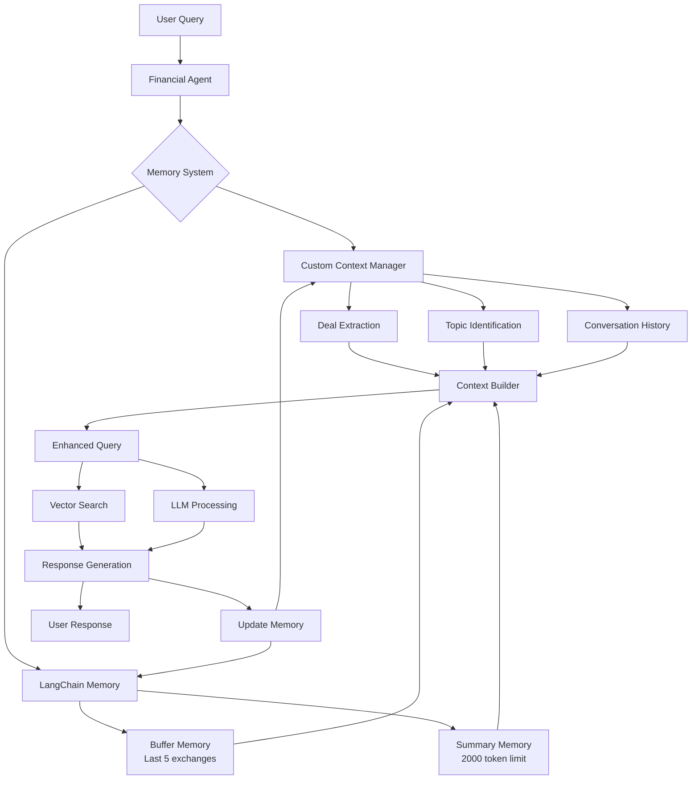

# 🧠 Memory System Architecture

## Overview

The Financial Forecast AI App implements a sophisticated dual-memory system that combines **Custom Context Management** with **LangChain Memory Components** to provide superior conversation continuity and context awareness.

---

## 🏗️ Architecture Diagram



---

## 🔄 Memory Flow Diagram

```
┌─────────────────────────────────────────────────────────────────────┐
│                           MEMORY LIFECYCLE                          │
└─────────────────────────────────────────────────────────────────────┘

1. USER INPUT
   ┌─────────────────┐
   │ "Tell me about  │
   │ deal 2025-001"  │
   └─────────────────┘
           │
           ▼
2. MEMORY RETRIEVAL
   ┌─────────────────────────────────────────────────────────────────┐
   │ Custom Context:                                                 │
   │ ├── Recent Deals: ["2025-001"]                                  │
   │ ├── Current Topic: "deal_analysis"                              │
   │ └── History: [previous conversations]                           │
   │                                                                 │
   │ LangChain Memory:                                              │
   │ ├── Buffer: Last 5 message pairs                               │
   │ └── Summary: "User previously asked about bond pricing..."      │
   └─────────────────────────────────────────────────────────────────┘
           │
           ▼
3. CONTEXT BUILDING
   ┌─────────────────────────────────────────────────────────────────┐
   │ Enhanced Query:                                                 │
   │ "Based on our previous discussion about bond pricing and your   │
   │ interest in deal 2025-001, tell me about deal 2025-001"        │
   └─────────────────────────────────────────────────────────────────┘
           │
           ▼
4. PROCESSING & RESPONSE
   ┌─────────────────────────────────────────────────────────────────┐
   │ Vector Search + LLM Analysis                                    │
   │ "Deal 2025-001 is a municipal bond issue by..."                │
   └─────────────────────────────────────────────────────────────────┘
           │
           ▼
5. MEMORY UPDATE
   ┌─────────────────────────────────────────────────────────────────┐
   │ Both memory systems updated with new exchange                   │
   │ Ready for next interaction                                      │
   └─────────────────────────────────────────────────────────────────┘
```

---

## 🎛️ Memory Components Detail

### 1. Custom Context Manager

```python
conversation_context = {
    "recent_deals": ["2025-001", "2025-003"],      # Automatically extracted
    "current_topic": "deal_analysis",              # Inferred from conversation
    "last_query_type": "details",                  # Query classification
    "confidence_score": 0.85                       # Context relevance
}

conversation_history = [
    {
        "user": "Tell me about deal 2025-001",
        "assistant": "Deal 2025-001 is a municipal bond...",
        "timestamp": "2025-10-24T10:30:00",
        "extracted_deals": ["2025-001"],
        "topic": "deal_analysis"
    }
]
```

### 2. LangChain Memory Components

#### Buffer Memory (ConversationBufferWindowMemory)
```python
# Keeps last 5 message exchanges
buffer_memory = ConversationBufferWindowMemory(
    k=5,                                    # Number of exchanges to keep
    memory_key="chat_history",              # Key for retrieval
    return_messages=True                    # Return as message objects
)

# Example content:
messages = [
    HumanMessage(content="What's the pricing date for 2025-001?"),
    AIMessage(content="The pricing date for deal 2025-001 is March 15, 2025."),
    HumanMessage(content="What about the deal size?"),
    AIMessage(content="Deal 2025-001 has a total size of $500 million."),
    # ... up to 5 exchanges
]
```

#### Summary Memory (ConversationSummaryBufferMemory)
```python
# Automatically summarizes when token limit exceeded
summary_memory = ConversationSummaryBufferMemory(
    llm=BedrockChat(model_id="amazon.titan-text-premier-v1:0"),
    max_token_limit=2000,                   # When to trigger summarization
    memory_key="conversation_summary"       # Key for retrieval
)

# Example summary:
summary = """
The user has been analyzing municipal bond deals, specifically focusing on 
deal 2025-001 (City of Springfield, $500M, March 2025 pricing) and deal 
2025-003 (Metro Transit Authority, $750M, April 2025 pricing). Main interests 
include pricing dates, deal structures, and yield comparisons.
"""
```

---

## 🔍 Memory Usage Scenarios

### Scenario 1: New Conversation
```
User: "Tell me about deal 2025-001"

Memory State:
├── Custom Context: {} (empty)
├── Buffer Memory: [] (empty)
└── Summary Memory: "" (empty)

Processing:
├── Extract deals: ["2025-001"]
├── Identify topic: "deal_analysis"
└── Build basic query context

Response: "Deal 2025-001 is a municipal bond issue..."

Updated Memory:
├── Custom Context: {"recent_deals": ["2025-001"], "current_topic": "deal_analysis"}
├── Buffer Memory: [HumanMessage, AIMessage]
└── Summary Memory: "" (still below token limit)
```

### Scenario 2: Follow-up Question
```
User: "What's the pricing date?"

Memory State:
├── Custom Context: {"recent_deals": ["2025-001"], "current_topic": "deal_analysis"}
├── Buffer Memory: [Previous exchange about 2025-001]
└── Summary Memory: "" (still empty)

Processing:
├── Context-aware: Knows "pricing date" refers to deal 2025-001
├── Enhanced query: "What's the pricing date for deal 2025-001?"
└── No need for user to repeat deal number

Response: "The pricing date for deal 2025-001 is March 15, 2025."
```

### Scenario 3: Long Conversation with Summarization
```
After 10+ exchanges...

Memory State:
├── Custom Context: {"recent_deals": ["2025-001", "2025-003"], "current_topic": "comparative_analysis"}
├── Buffer Memory: [Last 5 exchanges only]
└── Summary Memory: "User analyzing multiple municipal bonds, compared 2025-001 vs 2025-003..."

Benefits:
├── Maintains context without token overflow
├── Preserves key conversation themes
└── Enables reference to earlier discussion points
```

---

## 🎨 UI Memory Visualization

### Memory Status Display
```
┌─────────────────────────────────────────────────────────────────┐
│ 🧠 Custom Context: 📊 Recent deals: 2025-001, 2025-003 |      │
│                    🎯 Current focus: Deal Analysis              │
├─────────────────────────────────────────────────────────────────┤
│ 🧠 LangChain Memory: 🔤 Buffer: 5 messages | 📄 Summary: Active │
└─────────────────────────────────────────────────────────────────┘
```

### Memory Controls Sidebar
```
┌─────────────────────────────────┐
│ ## 🧠 Memory Controls           │
├─────────────────────────────────┤
│ 🗑️ Clear Custom Context        │
│ 🧽 Clear LangChain Memory       │
│ 🔥 Clear All Memory             │
├─────────────────────────────────┤
│ Memory Stats:                   │
│ • Buffer: 5/5 exchanges         │
│ • Summary: 1,250/2,000 tokens   │
│ • Context: 3 deals tracked      │
└─────────────────────────────────┘
```

---

## ⚙️ Configuration & Settings

### Memory Initialization
```python
def _initialize_langchain_memory(self):
    """Initialize LangChain memory components"""
    
    # Buffer memory for recent exchanges
    self.buffer_memory = ConversationBufferWindowMemory(
        k=5,                                # Configurable: number of exchanges
        memory_key="chat_history",
        return_messages=True
    )
    
    # Summary memory for long conversations
    self.summary_memory = ConversationSummaryBufferMemory(
        llm=BedrockChat(
            model_id="amazon.titan-text-premier-v1:0",
            region_name="us-east-1"
        ),
        max_token_limit=2000,               # Configurable: when to summarize
        memory_key="conversation_summary"
    )
```

### Memory Configuration Options
| Setting | Default | Description |
|---------|---------|-------------|
| `buffer_window_size` | 5 | Number of message exchanges to keep in buffer |
| `summary_token_limit` | 2000 | Token threshold for triggering summarization |
| `context_deal_limit` | 10 | Maximum number of deals to track in context |
| `memory_persistence` | Session | Whether to persist memory across sessions |

---

## 🔧 Memory Management Methods

### Adding to Memory
```python
def add_to_langchain_memory(self, user_message: str, ai_response: str):
    """Add conversation exchange to LangChain memory"""
    if self.buffer_memory:
        self.buffer_memory.save_context(
            {"input": user_message},
            {"output": ai_response}
        )
    
    if self.summary_memory:
        self.summary_memory.save_context(
            {"input": user_message},
            {"output": ai_response}
        )
```

### Retrieving Memory Context
```python
def get_langchain_conversation_context(self) -> str:
    """Get conversation context from LangChain memory"""
    context_parts = []
    
    # Get buffer memory
    if self.buffer_memory:
        buffer_context = self.buffer_memory.load_memory_variables({})
        if buffer_context.get("chat_history"):
            context_parts.append("Recent conversation:")
            for msg in buffer_context["chat_history"]:
                role = "Human" if isinstance(msg, HumanMessage) else "Assistant"
                context_parts.append(f"{role}: {msg.content}")
    
    # Get summary if available
    if self.summary_memory:
        summary_context = self.summary_memory.load_memory_variables({})
        if summary_context.get("conversation_summary"):
            context_parts.append(f"Previous discussion summary: {summary_context['conversation_summary']}")
    
    return "\n".join(context_parts) if context_parts else ""
```

### Memory Statistics
```python
def get_langchain_memory_stats(self) -> dict:
    """Get detailed memory statistics"""
    return {
        "buffer_memory_enabled": self.buffer_memory is not None,
        "summary_memory_enabled": self.summary_memory is not None,
        "buffer_messages": len(self.buffer_memory.chat_memory.messages) if self.buffer_memory else 0,
        "summary_available": bool(self.summary_memory and self.summary_memory.load_memory_variables({}).get("conversation_summary"))
    }
```

---

## 🚀 Benefits of Dual Memory System

### 1. **Immediate Context** (Custom)
- ✅ Fast deal extraction and tracking
- ✅ Topic identification and classification
- ✅ Lightweight and responsive
- ✅ Domain-specific optimizations

### 2. **Advanced Memory** (LangChain)
- ✅ Professional conversation management
- ✅ Automatic summarization
- ✅ Token-aware memory handling
- ✅ Extensible and standardized

### 3. **Combined Power**
- 🎯 **Context-aware responses** without repetition
- 📚 **Long conversation support** with summarization
- 🔄 **Seamless conversation flow** across topics
- 🎛️ **User control** over memory management
- 📊 **Memory transparency** with status displays

---

## 🛠️ Troubleshooting Memory Issues

### Common Issues & Solutions

#### Memory Not Working
```python
# Check memory initialization
if not hasattr(agent, 'buffer_memory') or agent.buffer_memory is None:
    print("Buffer memory not initialized - check AWS credentials")

# Verify memory content
memory_stats = agent.get_langchain_memory_stats()
print(f"Memory status: {memory_stats}")
```

#### Context Not Maintained
```python
# Check conversation history
if hasattr(agent, 'conversation_history'):
    print(f"History entries: {len(agent.conversation_history)}")
    
# Verify context extraction
context = agent.conversation_context
print(f"Current context: {context}")
```

#### Memory Overflow
```python
# Monitor token usage
if agent.summary_memory:
    summary_vars = agent.summary_memory.load_memory_variables({})
    if summary_vars.get("conversation_summary"):
        print("Summary memory active - long conversation detected")
```

---

## 📈 Future Enhancements

### Planned Improvements
1. **Persistent Memory** - Save memory across sessions
2. **Smart Context Pruning** - Intelligent removal of outdated context
3. **Memory Analytics** - Detailed usage statistics and insights
4. **Custom Memory Types** - Domain-specific memory components
5. **Memory Export/Import** - Backup and restore conversation history

### Configuration Expansion
```python
memory_config = {
    "buffer_size": 10,                    # Increase buffer size
    "summary_model": "claude-3-opus",     # Use different summarization model
    "context_persistence": True,          # Enable cross-session persistence
    "smart_pruning": True,               # Enable intelligent context cleanup
    "memory_analytics": True             # Enable detailed memory tracking
}
```

---

*This memory system provides the foundation for sophisticated conversation management in financial analysis, ensuring users never lose context while maintaining optimal performance.*