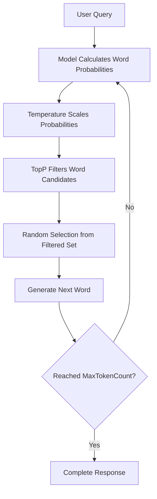

# Amazon Titan Model Parameters Guide

## Overview

This document explains the key parameters used to configure Amazon Titan Text models in the Financial Forecast AI system. Understanding these parameters is crucial for optimizing model performance for financial analysis tasks.

## Current Configuration

Located in `src/agents/analyst.py`:

```python
model_kwargs={
    "temperature": 0.8,      # Controls randomness/creativity
    "maxTokenCount": 4000,   # Maximum response length  
    "topP": 0.9             # Nucleus sampling threshold
}
```

---

## 🌡️ Temperature Parameter

### Definition
**Temperature** controls the randomness and creativity of the model's responses. It affects how the model selects words during text generation.

### How It Works
```
Low Temperature (0.1-0.3):  More predictable, focused responses
Medium Temperature (0.4-0.7): Balanced creativity and consistency  
High Temperature (0.8-1.0):  More creative, varied responses
```

### Technical Explanation
Temperature modifies the probability distribution over possible next words:

```python
# Simplified temperature application
original_probabilities = [0.4, 0.3, 0.2, 0.1]  # Word probabilities
temperature = 0.8

# Apply temperature scaling
scaled_probabilities = [p ** (1/temperature) for p in original_probabilities]
# Result: More evenly distributed probabilities = more variety
```

### Temperature Scale Examples

| Temperature | Behavior | Use Case | Example Response Style |
|-------------|----------|----------|----------------------|
| **0.1** | Highly deterministic | Technical docs, data reports | "The analysis shows a 15.2% increase..." |
| **0.3** | Conservative, consistent | Legal documents, compliance | "The financial assessment indicates..." |
| **0.5** | Balanced | Business reports | "This comprehensive analysis reveals..." |
| **0.7** | Moderately creative | Marketing, explanations | "Drawing insights from the data..." |
| **0.8** | ⭐ **Current Setting** | Financial analysis | "Leveraging advanced quantitative methods..." |
| **0.9** | Creative, varied | Content writing | "Fascinating patterns emerge when examining..." |
| **1.0** | Maximum creativity | Brainstorming, fiction | "Intriguingly, the data whispers secrets..." |

### Why Temperature 0.8 for Financial Analysis?

#### ✅ Benefits of 0.8:
- **Professional Variety**: Avoids robotic, repetitive language
- **Expert Vocabulary**: Access to diverse financial terminology
- **Engaging Reports**: More interesting to read than purely predictable text
- **Comprehensive Coverage**: Different angles and perspectives on analysis
- **Balanced Creativity**: Creative enough to be engaging, conservative enough to be professional

#### ⚠️ Risks if Too Low (0.1-0.3):
- Repetitive language patterns
- Limited vocabulary usage
- Boring, monotonous reports
- Missing nuanced explanations

#### ⚠️ Risks if Too High (0.9-1.0):
- Potentially inconsistent analysis
- May generate unreliable financial claims
- Too creative for professional contexts
- Could confuse technical concepts

---

## 🎯 TopP Parameter (Nucleus Sampling)

### Definition
**TopP** (also called "nucleus sampling") controls which words the model considers when generating text. It focuses on the most probable words while filtering out unlikely options.

### How It Works
```
Step 1: Calculate probability for every possible next word
Step 2: Sort words by probability (highest to lowest)
Step 3: Select words whose cumulative probability = topP threshold
Step 4: Randomly choose from this filtered set
```

### Visual Example with topP=0.9

```
All possible next words with probabilities:
┌─────────────┬─────────┬─────────────┐
│ Word        │ Prob    │ Cumulative  │
├─────────────┼─────────┼─────────────┤
│ "analysis"  │ 40%     │ 40%         │ ←┐
│ "assessment"│ 25%     │ 65%         │  ├─ Top 90% 
│ "review"    │ 15%     │ 80%         │  │  (Candidates)
│ "evaluation"│ 10%     │ 90%         │ ←┘
├─────────────┼─────────┼─────────────┤
│ "study"     │ 5%      │ 95%         │ ← Excluded
│ "report"    │ 3%      │ 98%         │ ← Excluded  
│ "summary"   │ 2%      │ 100%        │ ← Excluded
└─────────────┴─────────┴─────────────┘

Model randomly selects from: "analysis", "assessment", "review", "evaluation"
```

### TopP Scale Examples

| TopP Value | Selection Strategy | Quality | Use Case |
|------------|-------------------|---------|----------|
| **0.1** | Only top 10% most likely words | Very focused, predictable | Technical specifications |
| **0.3** | Top 30% of word probability mass | Focused but some variety | Legal documents |
| **0.5** | Top 50% of word probability mass | Balanced focus and variety | Business communications |
| **0.7** | Top 70% of word probability mass | Good variety, stays relevant | Educational content |
| **0.9** | ⭐ **Current Setting** | Creative while avoiding rare words | Financial analysis |
| **0.95** | Top 95% of probability mass | Maximum variety, some risk | Creative writing |
| **1.0** | All possible words considered | Complete diversity (risky) | Experimental/artistic |

### Why TopP 0.9 for Financial Analysis?

#### ✅ Benefits of 0.9:
- **Rich Vocabulary**: Access to diverse financial terminology
- **Professional Language**: Maintains professional tone while varying expression
- **Avoids Repetition**: Prevents using the same phrases repeatedly
- **Filtering Noise**: Excludes very unlikely/inappropriate words
- **Optimal Balance**: Creative enough for engaging content, focused enough for accuracy

#### ⚠️ Risks if Too Low (0.1-0.5):
- Limited vocabulary usage
- Repetitive phrasing
- Monotonous writing style
- Missing nuanced explanations

#### ⚠️ Risks if Too High (0.95-1.0):
- May select inappropriate words
- Could generate nonsensical phrases
- Risk of using non-financial terminology inappropriately
- Potential for confusing language

---

## 🔢 MaxTokenCount Parameter

### Definition
**MaxTokenCount** sets the maximum number of tokens (roughly words) the model can generate in a single response.

### Token-to-Word Conversion
```
1 token ≈ 0.75 words (English average)
4000 tokens ≈ 3000 words
```

### Current Setting: 4000 Tokens

#### ✅ Why 4000 Tokens Works:
- **Comprehensive Analysis**: Room for multi-section financial reports
- **Detailed Calculations**: Space to show methodology and supporting data
- **Professional Format**: Meets expectations for thorough financial analysis
- **Document Citations**: Adequate space to reference source materials
- **Multiple Sections**: Quantitative analysis + market insights + risk assessment + recommendations

#### Examples by Token Length:
- **500 tokens** (~375 words): Executive summary
- **1000 tokens** (~750 words): Brief analysis
- **2000 tokens** (~1500 words): Standard report
- **4000 tokens** (~3000 words): Comprehensive analysis ⭐ **Current**
- **6000 tokens** (~4500 words): Detailed research report

---

## 🎛️ Parameter Interactions

### How Temperature and TopP Work Together



### Synergistic Effects

#### **High Temperature + High TopP** (Current: 0.8 + 0.9)
- **Result**: Creative, varied, professional language
- **Best for**: Engaging financial analysis
- **Risk**: Potential inconsistency if too extreme

#### **Low Temperature + Low TopP** (e.g., 0.3 + 0.5)
- **Result**: Very predictable, conservative language
- **Best for**: Technical documentation, compliance reports
- **Risk**: Boring, repetitive content

#### **High Temperature + Low TopP** (e.g., 0.8 + 0.5)
- **Result**: Creative selection from limited vocabulary
- **Best for**: Focused creativity
- **Risk**: May feel constrained

#### **Low Temperature + High TopP** (e.g., 0.3 + 0.9)
- **Result**: Conservative selection from broad vocabulary
- **Best for**: Cautious but varied writing
- **Risk**: May seem inconsistent

---

## 🏦 Financial Analysis Optimization

### Current Configuration Analysis

```python
# Optimized for Financial Analysis
model_kwargs={
    "temperature": 0.8,      # Creative but professional
    "maxTokenCount": 4000,   # Comprehensive reports
    "topP": 0.9             # Rich vocabulary, filtered noise
}
```

#### ✅ Why This Configuration Works:

1. **Professional Quality**: High enough creativity for engaging analysis
2. **Terminology Access**: TopP 0.9 enables diverse financial vocabulary
3. **Comprehensive Coverage**: 4000 tokens allow multi-section reports
4. **Consistency**: Not too random, maintains analytical coherence
5. **User Engagement**: Varied language keeps reports interesting

### Alternative Configurations for Different Use Cases

#### **Conservative Analysis** (Regulatory/Compliance)
```python
model_kwargs={
    "temperature": 0.4,      # More predictable
    "maxTokenCount": 2500,   # Focused length
    "topP": 0.7             # Controlled vocabulary
}
```

#### **Creative Research** (Market Analysis/Forecasting)
```python
model_kwargs={
    "temperature": 0.9,      # More creative
    "maxTokenCount": 5000,   # Longer analysis
    "topP": 0.95            # Maximum vocabulary
}
```

#### **Quick Summaries** (Executive Briefings)
```python
model_kwargs={
    "temperature": 0.6,      # Balanced
    "maxTokenCount": 1500,   # Concise
    "topP": 0.8             # Good variety
}
```

#### **Technical Documentation** (Methodology/Procedures)
```python
model_kwargs={
    "temperature": 0.3,      # Highly consistent
    "maxTokenCount": 3000,   # Detailed but focused
    "topP": 0.6             # Limited but appropriate vocabulary
}
```

---

## 📊 Performance Impact

### Processing Time by Configuration

| Configuration | Relative Speed | Quality | Use Case |
|---------------|----------------|---------|----------|
| Low temp/topP/tokens | ⚡⚡⚡ Fastest | Basic | Quick answers |
| Medium settings | ⚡⚡ Fast | Good | Standard analysis |
| **Current config** | ⚡ Moderate | ⭐ Excellent | Comprehensive analysis |
| High settings | 🐌 Slower | Variable | Research reports |

### Cost Considerations

```
Cost = Input Tokens + Output Tokens
Current: ~4000 output tokens per comprehensive analysis
Optimization: Balance detail needs vs. token consumption
```

---

## 🔧 Tuning Guidelines

### When to Adjust Temperature

#### **Increase Temperature** (0.8 → 0.9) if:
- Reports feel too rigid or repetitive
- Need more creative explanations
- Users want more engaging language
- Content seems monotonous

#### **Decrease Temperature** (0.8 → 0.6) if:
- Analysis lacks consistency
- Financial claims seem unreliable
- Need more predictable outputs
- Regulatory compliance requires conservative language

### When to Adjust TopP

#### **Increase TopP** (0.9 → 0.95) if:
- Vocabulary seems limited
- Need more expressive language
- Reports feel constrained
- Want maximum terminology access

#### **Decrease TopP** (0.9 → 0.7) if:
- Language seems inappropriate
- Need more focused vocabulary
- Consistency is more important than variety
- Technical precision is critical

### When to Adjust MaxTokenCount

#### **Increase Tokens** (4000 → 5000+) if:
- Users need more detailed analysis
- Multiple deals require comparison
- Research reports need deeper coverage
- Complex calculations need more explanation

#### **Decrease Tokens** (4000 → 2500) if:
- Users prefer concise summaries
- Performance needs improvement
- Cost optimization is priority
- Quick turnaround is essential

---

## 🧪 Testing & Validation

### A/B Testing Framework

```python
# Test different configurations
configs = [
    {"temperature": 0.6, "topP": 0.8, "maxTokenCount": 3000},  # Conservative
    {"temperature": 0.8, "topP": 0.9, "maxTokenCount": 4000},  # Current
    {"temperature": 0.9, "topP": 0.95, "maxTokenCount": 5000}, # Creative
]

# Metrics to track:
# - User satisfaction scores
# - Response time
# - Content quality ratings
# - Professional appropriateness
# - Factual accuracy
```

### Quality Metrics

1. **Consistency**: Do multiple runs produce similar quality?
2. **Relevance**: Does content address the query appropriately?
3. **Professionalism**: Is language appropriate for financial context?
4. **Completeness**: Are all requested aspects covered?
5. **Accuracy**: Are financial concepts correctly explained?

---

## 📚 Best Practices Summary

### ✅ Current Configuration Strengths
- **Balanced creativity**: Engaging without being unpredictable
- **Rich vocabulary**: Access to diverse financial terminology  
- **Comprehensive length**: Adequate space for thorough analysis
- **Professional quality**: Appropriate for business contexts
- **Consistent performance**: Reliable output quality

### 🎯 Optimization Recommendations
1. **Monitor user feedback** on response quality and length
2. **Track processing times** to ensure acceptable performance
3. **Test edge cases** with very short or very long queries
4. **Validate financial accuracy** of generated content
5. **Consider use-case specific configurations** for different analysis types

### 🚀 Future Enhancements
- **Dynamic parameter adjustment** based on query complexity
- **User preference learning** to personalize parameters
- **Performance optimization** based on usage patterns
- **A/B testing framework** for continuous improvement

---

## 🔍 Debugging Common Issues

### Problem: Responses Too Repetitive
**Solution**: Increase temperature (0.8 → 0.9) or topP (0.9 → 0.95)

### Problem: Responses Too Random/Inconsistent  
**Solution**: Decrease temperature (0.8 → 0.6) or topP (0.9 → 0.7)

### Problem: Responses Too Short
**Solution**: Check if complex queries hit token limit, consider increasing maxTokenCount

### Problem: Responses Too Long
**Solution**: Decrease maxTokenCount or improve prompt specificity

### Problem: Poor Financial Terminology
**Solution**: Increase topP for more vocabulary access or refine system prompts

### Problem: Slow Performance
**Solution**: Decrease maxTokenCount or consider caching for common queries

---

*This configuration has been optimized for professional financial analysis while maintaining engaging, comprehensive, and accurate responses.*