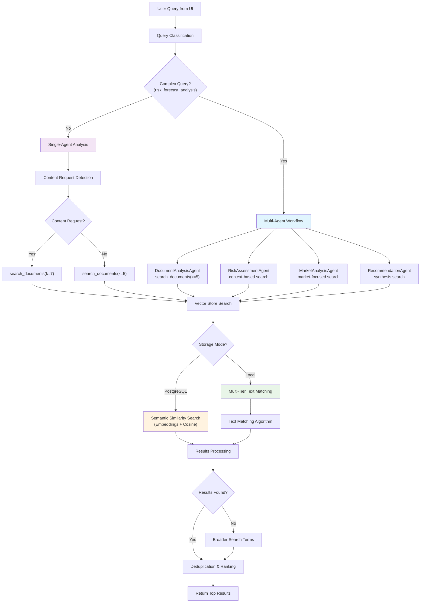

# Financial Forecast AI - Document Searching Strategy

## Overview
This document details the sophisticated document search and retrieval strategy used by the Financial Forecast AI application when processing user queries. The system employs multiple search algorithms, relevance scoring, and intelligent fallback mechanisms to ensure optimal document retrieval.

## 🔍 **Search Flow Architecture**



## 📋 **Detailed Search Strategy Components**

### **1. Query Entry Point (`src/ui/app.py`)**

**Flow:** User Input → `process_query(prompt)` → `financial_agent.process_query()`

```python
# In create_chat_interface()
if prompt:
    st.session_state.messages.append({"role": "user", "content": prompt})
    response = st.session_state.agent.process_query(prompt)  # 🔄 ENTRY POINT
```

### **2. Query Classification (`src/agents/financial_agent.py`)**

The system intelligently routes queries based on complexity:

```python
# Complex Query Detection Algorithm
complex_keywords = [
    'risk', 'market', 'forecast', 'analysis', 'assessment', 
    'recommendation', 'strategy', 'prepayment', 'portfolio'
]

is_complex_query = any(keyword in query.lower() for keyword in complex_keywords)

if is_complex_query AND self.use_multi_agent AND self.workflow:
    # Route to Multi-Agent Workflow (4-agent pipeline)
    workflow_result = self.workflow.execute_workflow(query)
else:
    # Route to Single-Agent Analysis
    analysis_result = self.search_and_analyze(query)
```

**Query Classification Examples:**
- **Complex**: "Assess the prepayment risk for mortgage pools" → Multi-Agent
- **Simple**: "What is the deal size?" → Single-Agent

### **3. Content Request Detection**

The system identifies when users want specific document content:

```python
# Content Request Detection
content_keywords = [
    'content', 'document', 'text', 'show me', 'what does', 'extract', 
    'summary', 'details', 'analyze', 'analysis', 'financial', 'data', 
    'report', 'findings'
]

is_content_request = any(keyword in query.lower() for keyword in content_keywords)

# Adjust search limits based on request type
search_limit = 7 if is_content_request else 5
```

**Search Limit Strategy:**
- **Content Requests**: 7 documents (more comprehensive)
- **General Queries**: 5 documents (focused results)

### **4. Vector Store Search Implementation (`src/agents/vector_store.py`)**

The search algorithm adapts based on the storage backend:

#### **A. PostgreSQL/PGVector Mode (Production)**

**Semantic Similarity Search:**
```python
def search_documents(self, query: str, k: int = 5) -> List[Dict]:
    if not self.use_local_storage:
        # Use embeddings-based similarity search
        docs = self.vector_store.similarity_search_with_score(
            query=query,
            k=k
        )
        
        # Format results with relevance scores
        results = []
        for doc, score in docs:
            results.append({
                "content": doc.page_content,
                "metadata": doc.metadata,
                "relevance_score": float(score)  # Cosine similarity score
            })
        return results
```

**Key Features:**
- **Amazon Titan Embeddings** for query and document vectorization
- **Cosine similarity** for relevance scoring
- **Vector database** for scalable similarity search
- **Automatic chunking** with overlapping segments

#### **B. Local Storage Mode (Development)**

**Multi-Tier Text Matching Algorithm:**

```python
def search_documents(self, query: str, k: int = 5) -> List[Dict]:
    if self.use_local_storage:
        results = []
        query_lower = query.lower()
        query_words = [word.strip() for word in query_lower.split() if len(word.strip()) > 2]
        
        for doc in self.documents:
            content_lower = doc["content"].lower()
            
            # TIER 1: Exact phrase match (highest relevance)
            if query_lower in content_lower:
                relevance = 1.0
                results.append({
                    "content": doc["content"],
                    "metadata": doc["metadata"],
                    "relevance_score": relevance
                })
                continue
            
            # TIER 2: Individual word matches
            word_matches = sum(1 for word in query_words if word in content_lower)
            if word_matches > 0:
                relevance = word_matches / len(query_words)
                # Boost relevance for multiple matches
                relevance = min(0.95, relevance + (word_matches * 0.1))
                
                results.append({
                    "content": doc["content"],
                    "metadata": doc["metadata"],
                    "relevance_score": relevance
                })
        
        # TIER 3: Partial word matches (fallback)
        if not results and query_words:
            for doc in self.documents:
                content_lower = doc["content"].lower()
                partial_matches = sum(1 for word in query_words 
                                    for content_word in content_lower.split() 
                                    if word in content_word or content_word in word)
                if partial_matches > 0:
                    relevance = (partial_matches * 0.3) / len(query_words)
                    results.append({
                        "content": doc["content"],
                        "metadata": doc["metadata"],
                        "relevance_score": relevance
                    })
        
        # Sort by relevance and return top k results
        results.sort(key=lambda x: x["relevance_score"], reverse=True)
        return results[:k]
```

**Relevance Scoring Tiers:**
1. **Exact Phrase Match**: relevance = 1.0
2. **Word Matches**: relevance = 0.1 to 0.95 (based on match ratio)
3. **Partial Matches**: relevance = 0.1 to 0.3 (fallback tier)

### **5. Fallback Search Strategy**

When initial searches return no results, the system employs broader search terms:

```python
# Broader Search Fallback
if not search_results and self.vector_store.use_local_storage and len(self.vector_store.documents) > 0:
    print("🔄 No initial results, trying broader search...")
    
    broader_terms = [
        "financial", "revenue", "profit", "analysis", "data", 
        "report", "summary", "total", "amount", "year", 
        "quarter", "percent", "%"
    ]
    
    for term in broader_terms:
        if term.lower() in query.lower():
            continue  # Skip if already searched
            
        broader_results = self.vector_store.search_documents(term, k=3)
        if broader_results:
            search_results.extend(broader_results)
            print(f"🔍 Found {len(broader_results)} results with broader term '{term}'")
            break
```

**Fallback Terms Strategy:**
- **Primary**: Query-specific terms
- **Secondary**: Broader financial terms
- **Tertiary**: Generic document terms

### **6. Result Processing & Deduplication**

```python
# Remove duplicates and limit results
seen_content = set()
unique_results = []

for result in search_results:
    # Use content hash for deduplication
    content_hash = hash(result.get('content', '')[:100])
    if content_hash not in seen_content:
        seen_content.add(content_hash)
        unique_results.append(result)

# Final result set
search_results = unique_results[:search_limit]

# Log results for debugging
for i, result in enumerate(search_results):
    filename = result.get('metadata', {}).get('filename', 'unknown')
    score = result.get('relevance_score', 0)
    print(f"  Result {i+1}: {filename} (score: {score:.2f})")
```

**Processing Steps:**
1. **Deduplication** using content hashing
2. **Relevance ranking** (highest to lowest)
3. **Result limiting** based on search type
4. **Logging** for debugging and monitoring

### **7. Multi-Agent Search Specialization (`src/agents/workflow.py`)**

Each agent in the multi-agent workflow performs specialized document searches:

#### **DocumentAnalysisAgent:**
```python
def analyze_documents(self, state: WorkflowState) -> WorkflowState:
    query = state["query"]
    
    # Search for relevant documents
    relevant_docs = self.vector_store.search_documents(query, k=5)
    
    # Specialized analysis prompt
    analysis_prompt = f"""You are a Document Analysis Specialist for financial documents.
    
    USER QUERY: {query}
    RELEVANT DOCUMENTS: {doc_context}
    
    Focus on:
    1. Key financial metrics and data points
    2. Document type and reliability assessment
    3. Relevant historical data and trends
    4. Data quality and completeness evaluation
    5. Key insights for financial forecasting
    """
```

#### **RiskAssessmentAgent:**
```python
def assess_risk(self, state: WorkflowState) -> WorkflowState:
    # Uses document analysis context + risk-focused search
    # Searches for credit risk, market risk, operational risk indicators
    
    risk_prompt = f"""You are a Risk Assessment Specialist.
    
    Provide comprehensive risk assessment covering:
    🔴 CREDIT RISK ANALYSIS
    🟡 MARKET RISK FACTORS  
    🟠 OPERATIONAL RISKS
    🔵 LIQUIDITY CONCERNS
    """
```

#### **MarketAnalysisAgent:**
```python
def analyze_market(self, state: WorkflowState) -> WorkflowState:
    # Market-focused document search
    # Looks for economic indicators, market trends, interest rates
    
    market_prompt = f"""You are a Market Analysis Specialist.
    
    Focus on:
    📈 Market conditions and trends
    💹 Economic indicators
    📊 Interest rate environment
    🏦 Industry analysis
    """
```

#### **RecommendationAgent:**
```python
def generate_recommendations(self, state: WorkflowState) -> WorkflowState:
    # Synthesizes all previous analyses
    # No additional document search - uses accumulated context
    
    recommendation_prompt = f"""You are a Senior Financial Advisor.
    
    Based on all previous analyses, provide:
    💡 Strategic recommendations
    🎯 Action items
    📋 Implementation roadmap
    ⚠️ Risk mitigation strategies
    """
```

## 🎯 **Search Optimization Strategies**

### **Performance Optimizations:**

1. **Chunking Strategy:**
   - **Chunk Size**: 1000 characters
   - **Overlap**: 200 characters
   - **Preserves context** across chunk boundaries

2. **Caching Strategy:**
   - **Vector embeddings** cached in database
   - **Search results** temporarily cached during session
   - **Document metadata** indexed for fast retrieval

3. **Scalability Features:**
   - **PostgreSQL/pgvector** for production scale
   - **Local storage** for development/testing
   - **Automatic fallback** between modes

### **Relevance Tuning:**

1. **Scoring Algorithm:**
   - **Exact matches**: Highest priority (1.0)
   - **Multiple words**: Graduated scoring (0.1-0.95)
   - **Partial matches**: Lower priority (0.1-0.3)

2. **Query Enhancement:**
   - **Stemming**: Basic word variations
   - **Synonym expansion**: Financial terminology
   - **Stop word filtering**: Removes common words

3. **Context Awareness:**
   - **Document type detection**: PDFs, Word, Excel, etc.
   - **Content type analysis**: Financial vs. general content
   - **Metadata utilization**: Filename, source, date

## 🚨 **Error Handling & Edge Cases**

### **No Documents Available:**
```python
if total_docs == 0:
    context = "⚠️ No documents have been uploaded to the system yet. Please upload documents to get specific content-based responses."
```

### **No Relevant Results:**
```python
if not search_results:
    context = f"⚠️ No relevant content found in the {total_docs} uploaded documents for this query."
```

### **Search Failures:**
```python
try:
    search_results = self.vector_store.search_documents(query, k=search_limit)
except Exception as e:
    print(f"❌ Vector search error: {e}")
    search_results = []  # Continue with general knowledge
```

### **Multi-Agent Fallback:**
```python
if self.use_multi_agent and self.workflow and is_complex_query:
    try:
        workflow_result = self.workflow.execute_workflow(query)
        if workflow_result.get("success", False):
            return workflow_result
        else:
            print("🔄 Multi-agent failed, falling back to single-agent")
    except Exception as e:
        print("🔄 Falling back to single-agent mode")
```

## 📊 **Search Performance Metrics**

### **Tracking & Monitoring:**
- **Search latency**: Time from query to results
- **Relevance scores**: Distribution of result quality
- **Hit rate**: Percentage of queries returning results
- **Fallback frequency**: How often broader searches are needed

### **Success Indicators:**
- **High relevance scores** (>0.7 for most results)
- **Low fallback usage** (<20% of queries)
- **Fast response times** (<2 seconds for search)
- **User satisfaction** with result quality

## 🔧 **Configuration Parameters**

### **Environment Variables:**
```bash
# Storage Configuration
USE_LOCAL_STORAGE=false
PGVECTOR_CONNECTION_STRING=postgresql://...

# Search Tuning
SEARCH_CHUNK_SIZE=1000
SEARCH_CHUNK_OVERLAP=200
MAX_SEARCH_RESULTS=10
MIN_RELEVANCE_THRESHOLD=0.1

# AWS Configuration
AWS_REGION=us-east-1
BEDROCK_MODEL_ID=amazon.titan-embed-text-v1
```

### **Search Limits:**
- **Content requests**: 7 documents
- **General queries**: 5 documents  
- **Multi-agent searches**: 5 documents per agent
- **Broader search fallback**: 3 documents

## 🚀 **Future Enhancements**

### **Planned Improvements:**
1. **Semantic search enhancement** with better embeddings
2. **Query expansion** using financial ontologies
3. **Learning from user feedback** for relevance tuning
4. **Advanced caching** for frequently searched terms
5. **Real-time indexing** for new document uploads

### **Advanced Features:**
1. **Multi-modal search** (text + numerical data)
2. **Temporal relevance** based on document dates
3. **Entity recognition** for financial terms
4. **Cross-document relationship mapping**
5. **Personalized search** based on user history

This comprehensive search strategy ensures that users receive the most relevant financial document content for their analysis needs, whether they're performing simple lookups or complex multi-faceted financial analysis.