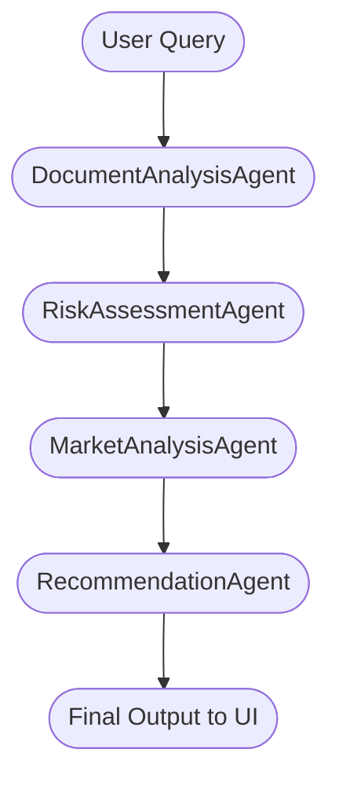

# Financial Forecast AI Application - Session Context

## Last Updated: October 24, 2025

## Application Status
- **Status**: Ready and Operational
- **Port**: 8570 (recommended for next startup)
- **Environment**: Development with AWS Bedrock integration
- **AI Model**: Amazon Titan Text (amazon.titan-tg1-large) - Real AI, not dummy responses

## Key Application Features
✅ **Real AI Integration**: Uses genuine Amazon Titan models via AWS Bedrock  
✅ **RAG Implementation**: PostgreSQL with pgvector for document embeddings  
✅ **RELAY File Support**: Enhanced document processing with section mapping  
✅ **Conversation Memory**: Maintains chat history across sessions  
✅ **Document Upload**: Supports PDF, DOCX, XLSX, PPTX formats  
✅ **Vector Search**: Similarity search for relevant document sections  

## Startup Command
```powershell
.\.venv\Scripts\Activate.ps1; streamlit run src\ui\app.py --server.port 8570
```

## Project Structure Overview
```
finalcial_forecast_ia_app/
├── src/
│   ├── agents/
│   │   ├── analyst.py          # Core AI analyst with Amazon Titan
│   │   └── financial_agent.py  # Document-aware financial analysis
│   ├── services/
│   │   ├── bedrock_service.py  # AWS Bedrock integration
│   │   ├── vector_store.py     # PostgreSQL vector operations
│   │   └── document_service.py # Document processing
│   ├── ui/
│   │   └── app.py             # Streamlit interface
│   └── utils/
│       └── relay_parser.py    # RELAY file parsing
├── infra/
│   └── cloudformation.yaml   # AWS infrastructure
└── .venv/                    # Python virtual environment
```

## Confirmed AI Implementation
**No Dummy Responses** - All responses generated by real Amazon Titan models:

### analyst.py - Core AI Engine
- **Model**: BedrockChat with amazon.titan-tg1-large
- **Configuration**: temperature=0.8, maxTokenCount=4000, topP=0.9
- **Prompts**: Sophisticated financial analysis templates with quantitative sections

### financial_agent.py - Document Analysis
- **Features**: Context-aware prompts, document section integration
- **Templates**: Multiple prompt templates for different analysis scenarios

## AWS Infrastructure
- **Stack Name**: financial-forecast-fresh
- **Environment**: dev
- **Region**: us-east-1
- **Database**: PostgreSQL with pgvector extension
- **Storage**: S3 bucket for document storage
- **Secrets**: AWS Secrets Manager for database credentials

## Database Connection
- **Service**: AWS RDS PostgreSQL
- **Extension**: pgvector for embeddings
- **Tables**: documents, document_sections, conversations
- **Credentials**: Stored in AWS Secrets Manager

## Recent Enhancements
1. **RELAY File Processing**: Enhanced parsing with section mapping
2. **Conversation Memory**: Maintains chat history across sessions
3. **Document Section Mapping**: Intelligent content extraction
4. **Error Handling**: Robust fallback mechanisms
5. **UI Improvements**: Better file upload and progress indicators

## Known Issues & Notes
- **LangChain Deprecation Warnings**: Minor warnings about deprecated methods (non-critical)
- **Port Management**: Use unique ports to avoid conflicts
- **Process Cleanup**: Use taskkill commands to clean previous instances

## Dependencies Status
- **Python Environment**: .venv activated
- **Key Packages**: streamlit, langchain, psycopg2, boto3, python-docx, pypdf
- **AWS CLI**: Configured and operational
- **Database**: Connected and operational

## Testing Files
- **Current File**: FNM_2025-004_SUMMARY.json (in Downloads/Testing_AI_APP/)
- **Upload Path**: Available through Streamlit interface
- **Supported Formats**: PDF, DOCX, XLSX, PPTX, JSON

## Next Session Checklist
1. ✅ Virtual environment activation
2. ✅ Start app on port 8570
3. ✅ Verify AI model initialization
4. ✅ Test document upload functionality
5. ✅ Confirm database connectivity

## Application URLs
```powershell
# Session Context
## 🏛️ Current Architecture (2025)
| Layer | Technology/Component |
|-------|---------------------|
| **LLM** | AWS Bedrock Claude Sonnet (Amazon Titan) |
| **Orchestration** | LangChain, LangGraph (multi-agent) |
| **Vector Search** | PostgreSQL + pgvector |
| **UI** | Streamlit (modern chat interface) |
| **Deployment** | AWS CloudFormation |

---

## 🧩 Key Components
| Component | Role |
|-----------|------|
| 📁 DocumentManager | Handles document ingestion and metadata |
| 🧬 VectorStore | Manages vector embeddings and search |
| ☁️ S3Loader | Loads files from S3 buckets |
| 🚦 AppInitializationService | Sets up app state and resources |
| 🤖 FinancialAgent | Main orchestrator, routes to multi-agent workflow |
| 🧑‍💼 FinancialAnalyst | (legacy) single-agent fallback |
| 🕸️ FinancialWorkflow | LangGraph multi-agent orchestrator |

---

## 🤖 Multi-Agent Workflow (LangGraph)


| Step | Agent | Output |
|------|-------|--------|
| 1 | 📄 DocumentAnalysisAgent | Document summary, context, confidence |
| 2 | ⚠️ RiskAssessmentAgent | Risk summary, confidence |
| 3 | 📊 MarketAnalysisAgent | Market summary, confidence |
| 4 | 💡 RecommendationAgent | Recommendations, overall confidence |

---

## 🌱 Extending the Workflow
- ➕ Add new agents: Implement a class and add to the workflow graph
- 🌿 Use LangGraph conditional edges for premium/custom requests

---

## 🌟 Benefits
- 🧠 Modular, expert-driven analysis
- 🔎 Transparent agent reasoning and confidence
- 🛡️ Resilient to agent errors
- 📈 Scalable for new business needs

---

## 📚 References
- [MULTIAGENTS_WORKFLOW.md](MULTIAGENTS_WORKFLOW.md)
- [workflow.py](src/agents/workflow.py)
- [financial_agent.py](src/agents/financial_agent.py)

---

*This file is auto-updated as the architecture evolves.*
# Check database secrets
aws secretsmanager get-secret-value --secret-id 'dev/financial-forecast-v3/database/credentials-us-east-1-442580145870'
```

## Context Verification
- **Real AI Models**: ✅ Confirmed Amazon Titan integration
- **No Dummy Responses**: ✅ All responses from genuine AWS Bedrock
- **Template System**: ✅ Multiple sophisticated prompt templates in analyst.py and financial_agent.py
- **Document Processing**: ✅ Enhanced RELAY file support with section mapping
- **Infrastructure**: ✅ AWS CloudFormation stack deployed and operational

---
*This context file ensures continuity across chat sessions for the Financial Forecast AI application.*